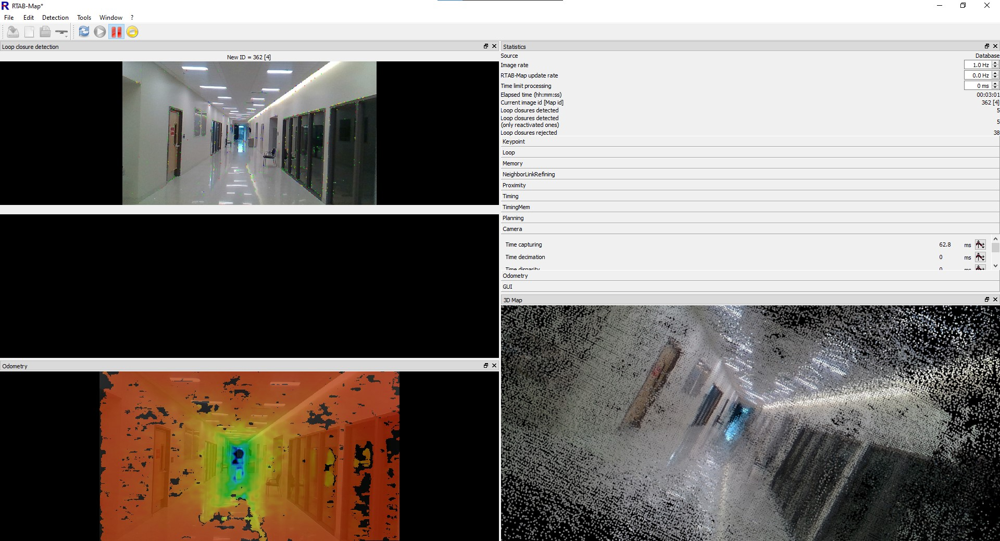
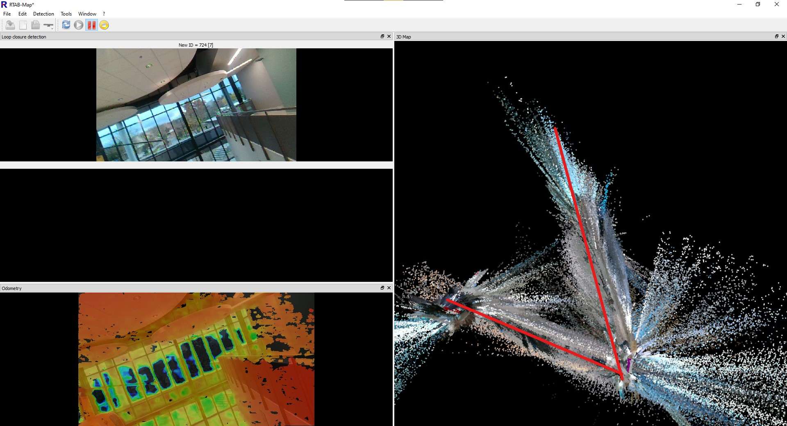
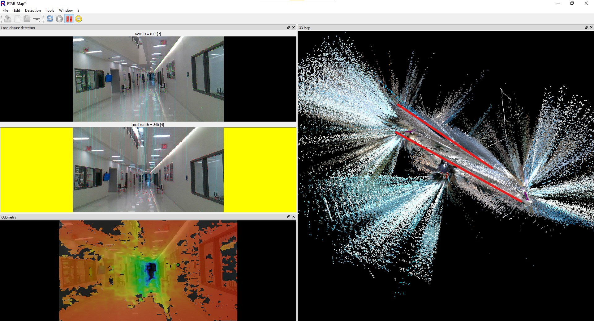

Apologies for posting this update a day late, our team was pretty excited with some developments and forgot to update
yesterday.

On Thursday (or keeping with our team name, Thor's Day), some parts that we ordered came in. We now have our Jetson
Nano, which will act as the primary processor for the robot. This specific computer was chosen as it packs more
processing power than other single board computers on the market, and at \$50 for 2GB of RAM, it is also one of the less
single board computers on the market. Additionally, we received a servo motor, so that we can test it to confirm that
it will work for our application. Finally, we received an Intel Realsense D415.

The [Realsense D415](https://www.intelrealsense.com/depth-camera-d415/) is a three camera system that is capable of not
full color images, but 3D depth data as well. It does this by using one camera for full color,
and two other cameras for depth perception this dual camera setup is the same way that humans are able to see depth,
with our eyes acting as cameras). This camera will act as the primary navigation sensor on our robot,
allowing it to automatically build a map of its surroundings.

To test out this sensor, I took it for a walk around the STEM building on campus, and used a program called
[RTABMap](http://introlab.github.io/rtabmap/) to see how well it could keep track of its position. The answer turned out
to be that it did a phenomenal job at tracking full 6DOF position (X,Y,Z, Yaw, Pitch, Roll), without anything else but
the camera.
{: .center-image }
Starting the walk down the hall of the STEM Building.
{: .center-image-caption}

As the image above shows, the walk down shows the camera doing a great good job. On the left of the display are three
different image windows. The top image is the current view from the camera. All of the small colored dots on the image
are "features" that the software detected in the image, and will use to track the camera's current position.
Below that is a display that is currently black. If the software thinks that it recognizes an image as matching a place
it has seen before, it will display the image it is comparing to there. At the very bottom is the depth image, showing
how far away each part of the image is from the camera. The black areas in the image are regions that it cannot
calculate the depth of.

On the right, we have a display of the current timing and configuration data, which is only visible as I was checking
it at the time of the screenshot being taken. Also, there is the 3D display, which shows all of the images that the
camera has taken, but projected into 3D using the depth sensor.

RTABMap uses a mapping technique called Loop Closure Detection. It builds up the map as data is collected, by mapping
the changes from the previous image to the current image, but at the same time, it scans the previous images to look for
any images that are the same, indicating that it has been to the same location before. If it finds a match, it is able
to draw a loop from the previous time it is been at that location, as shown below. 

{: .center-image-caption}

graph LR;
        1-->2-->3-->4-->5-.Loop Closure.->1;

A series of five images, with the fifth image showing a return to the same location as the first.
{: .center-image-caption}

Once a loop closure is found, it can be used to fix any errors that have built up the map. An example is shown below.

{: .center-image}
Before Loop Closure
{: .center-image-caption}

{: .center-image}
After Loop Closure
{: .center-image-caption}

The first image shows before I had finished walking all the way around the upstairs and downstairs on the STEM building
on campus, with the hallways highlighted on the map. RTABMap seems to think the the upper and lower hallways are
at a sharp angle to each other, incorrect, the are actually parallel to each other, and stacked on top of each other.
However, because it lacks any information to tell itself this, it does not realize that it is incorrect.

In the second image, I have finished walking all the way around the two halls. As RTABMap recognized the lower hall as
being a location it has visited before, and realizes that it miscalculated the position of the entire upper hallway. 
It was then able to use this information to adjust the entire map to properly fit the real world. 

One other thing to note from the data is the very large amount of data spraying out from the map. These are the times 
that the camera was able to see out a window, and it attempted to use that data to build the map further out. 
However, with the camera being farther away, and through glass that can distort the image, the quality is not very high. 
This is not too much of a problem, as if the robot does then move outside, it will update the map with new data that
is much higher quality. 