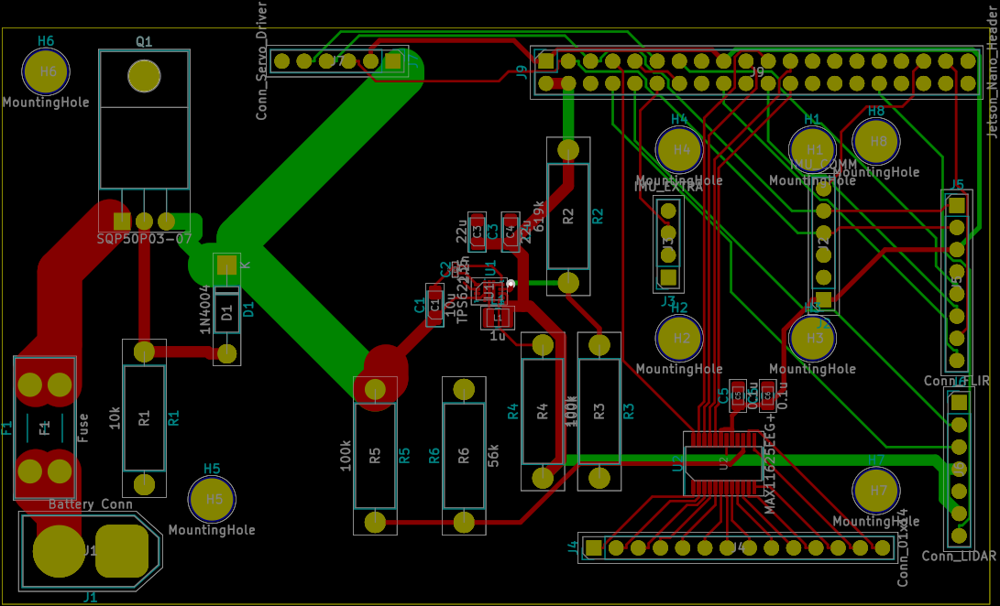
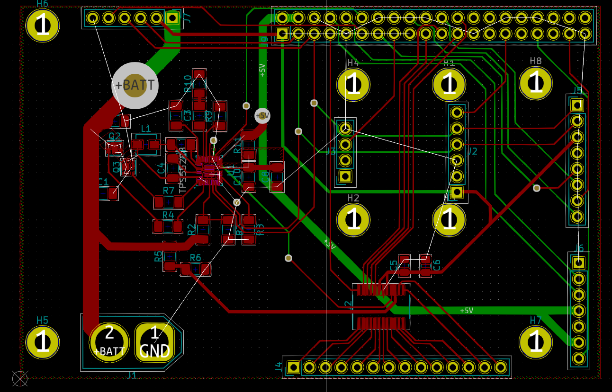
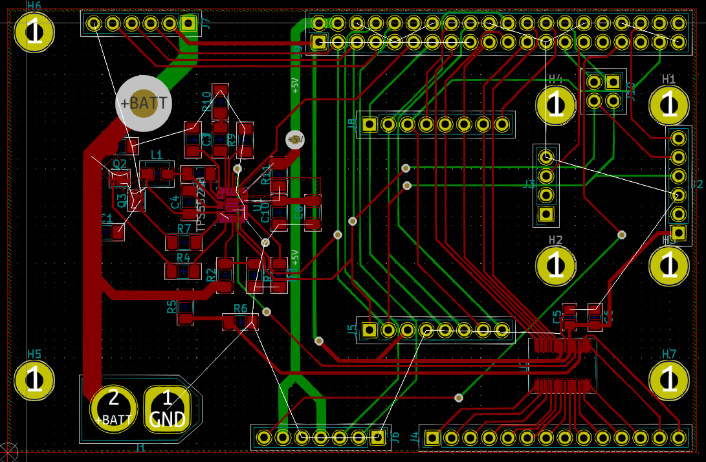

This week a few different things happened. Nick continues the implementation of the walking algorithm, Alex has
received the 3D printed servo mounts that will be used on the robot, and he continues refining the structural design
for the robot. Trevor has taken over working on ROS and the Jetson Nano to free myself up to work on re-designing the
custom PCB that we will use. In the past week, the PCB has undergone two revisions to improve its capabilities, which
means that a total of three revisions of the PCB have been designed so far.

## Revision 1

The first revision was a quick design last semester with the goal of demonstrating all of the main capabilities of the
board. This design was noticeable for the heavy use of through hole components to simplify soldering.

{: .center-image}
First Revision of the PCB
{: .center-image-caption}

## Revision 2

When the team begain placing orders this semester, it was discovered that the power converter IC that the team intended
to use was out of stock at all major distributer until December, so a new power IC had to be selected. Using the
[WEBENCH Power Designer](https://www.ti.com/design-resources/design-tools-simulation/webench-power-designer.html)
(_This should not be considered an endorsement of TI products by our team_) from
Texas Instruments, 4 possible new designs were found, and one based on the
[TPS55288](https://www.ti.com/product/TPS55288) was selected, as all four designs had the same unit cost, but the
TPS55288 based design offered the most capabilities.
As this IC is designed for USB Power Delivery, the output current limit and voltage can be controlled over I2C.
This I2C bus also allows for the IC to report some error states, it can be used for on-board debugging of the design
as well. Additionally, the IC has the ability to output a voltage proportional to the current draw of the load. While
this feature was designed to allow voltage compensation for loss in long wires, it can be also used as a general purpose
current sensor, which will greatly improve the battery calculations on the robot.

Another issue discovered was the orientation of the header on the PCB that would be connected to the Jetson Nano had the
pins mapped improperly, due to the fact that the KiCAD footprints for a pin header (a male connector), and a pin socket
(a female connector), were not the same.

These two issue required significant redesign of the PCB, leading to the second revision. During this process

{: .center-image}
PCB Revision 2
{: .center-image-caption}

## Revision 3

The second revision was considered feature complete, but it was decided that it fell short in expandability.
As designed, not all pins on the Jetson Nano were being utilized in the design. However, as a ribbon cable will be used
to link the Jetson Nano to the PCB, these pins will be inaccessible. If additional electronics are added to the design
an new PCB would have had to be designed.

PCB Revision 3 is still being finalized, but when complete, it will solve this problem by adding additional pin headers
to the board that allow for quick access to the additional pins. The small size of board meant that this requires
re-arranging most of the existing pin headers, making this revision more complex that expected.

{: .center-image}
PCB Revision 3 (in progress)
{: .center-image-caption}

## Revision 4?

A fourth revision of the PCB might be made. This would be a fairly minor version, adding test pads to the design.
Should we opt to have our PCB manufactured by a third part that adds a Solder Mask, test points will greatly simplify
any diagnostics that may be necessary.